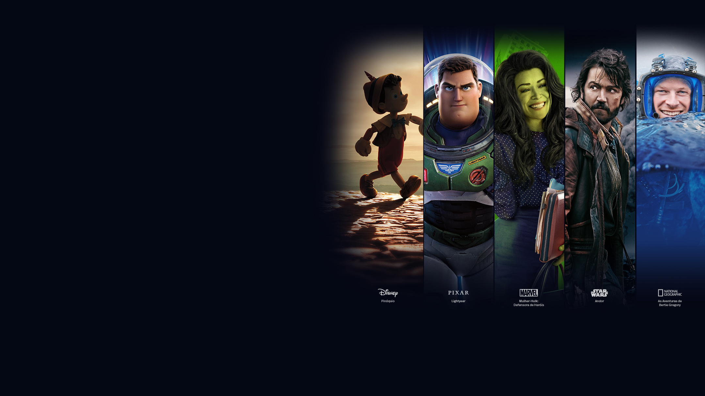

# Disney+ Clone

[](https://clone-disneyplus-ten-iota.vercel.app/) *(Projeto rodando na Vercel)*

Este projeto é um clone da landing page do Disney+, desenvolvido com foco em arquitetura CSS, manipulação de DOM com JavaScript puro e automação de tarefas. O objetivo é replicar a interface responsiva e interativa da plataforma, demonstrando habilidades avançadas em desenvolvimento front-end, uso de boas práticas e um código manutenível.

  
> **Dica para o Portfólio:** *Quando tiver a oportunidade, grave um GIF (.gif) navegando nas guias e no acordeão do FAQ e substitua o caminho da imagem logo acima para tornar o README ainda mais imersivo!*

---

## 🛠 Decisões Tecnológicas e Arquitetura (Visão Técnica)

A construção deste projeto foi planejada para ir além do visual, evidenciando domínio sobre os fundamentos da web:

### 1. SASS: Abstração e Arquitetura CSS
Para garantir uma estilização escalável e de fácil manutenção, utilizei o pré-processador **SASS** (`.scss`). A arquitetura do projeto implementa:
- **Variáveis e Mixins:** Criação de um sistema de tokens de design (cores, tipografia, breakpoints) e mixins para media queries, o que garante consistência total da UI e redução drástica de repetição de código.
- **Controle de Escopo:** O código faz aproveitamento do escopo e aninhamento de sintaxe do SASS para estruturar componentes isolados, impedindo vazamentos de estilo para o escopo global.
- **Modularização:** O design está segmentado por responsabilidade lógica, evidenciando um domínio real sobre a arquitetura da folha de estilos.

### 2. Gulp: Automação de Fluxos de Trabalho
O **Gulp** foi responsável pela automação das tarefas de pré-produção e pipeline de otimização de assets:
- **Compilação e Watch do SASS:** Transformação rápida do código SCSS para CSS e monitoramento em tempo real (watch) durante o desenvolvimento local.
- **Minificação e Otimização:** As "tasks" do Gulp comprimem o CSS final, realizam a minificação dos scripts em JavaScript e reduzem ativamente o peso das imagens carregadas — entregando assets performáticos otimizados para produção na pasta `dist/`.

### 3. JavaScript Vanilla: Manipulação de DOM Dinâmica
A interatividade da página foi criada do zero utilizando apenas **JavaScript puro** (Vanilla JS), sem a dependência de frameworks ou bibliotecas pesadas de terceiros:
- **Guias de Conteúdo (Shows Tabs):** Lógica limpa manipulando o objeto `classList` do DOM para lidar com estados ativos nas abas "Em Breve", "Mais Populares" e "Mais no Star+", mostrando que os componentes são renderizados e re-ativados de forma performática.
- **Acordeão de Perguntas (FAQ):** Tratamento de eventos de clique para expansão ou retração das respostas do FAQ dinamicamente. Demonstra uso eficiente de *Event Listeners*, percurso no DOM (*DOM traversal*) e gerenciamento da altura/estados visuais do elemento.

---

## 🚀 Como Rodar o Gulp e Levantar o Ambiente Local

Siga as instruções abaixo para testar o projeto ou estender o código localmente.

### Pré-requisitos
Para rodar este repositório, você vai precisar do [Node.js](https://nodejs.org/) instalado na sua máquina.

### Executando o Projeto:

1. **Clone o repositório:**
   ```bash
   git clone https://github.com/Alexandre-Mir/clone-disneyplus.git
   ```

2. **Acesse o diretório original:**
   ```bash
   cd clone-disneyplus
   ```

3. **Instale as dependências locais (NPM):**
   ```bash
   npm install
   ```

4. **Levante o Ambiente de Desenvolvimento (Watch):**
   Execute o script abaixo que dispara as tarefas de desenvolvimento do Gulp. O processo de 'watch' vai observar alterações dentro da pasta `src/` e re-compilar automaticamente para a pasta `dist/` conforme você edita o código.
   ```bash
   npm run dev
   ```

5. **Gerando Build de Produção:**
   Caso queira que o Gulp apenas otimize os arquivos para uma build em produção, execute:
   ```bash
   npm run build
   ```

---

*Nota legal: Este projeto é educacional e desvinculado oficialmente da Walt Disney Company. Logotipos, planos e imagens pertencem aos seus devidos proprietários.*
